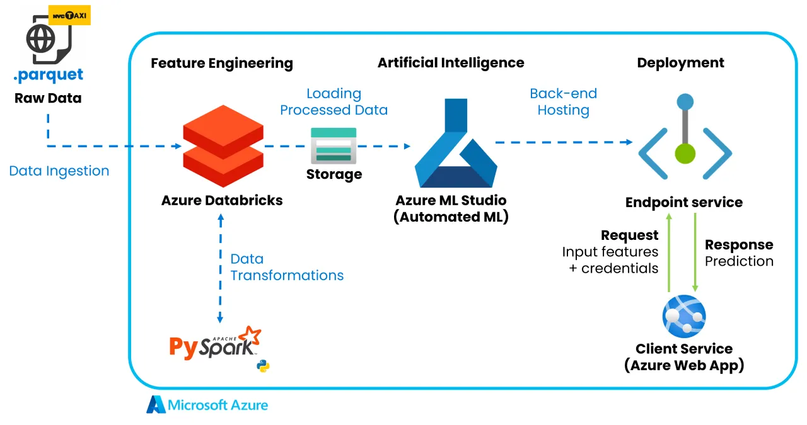

## Project Overview

This application provides daily demand forecasting for Yellow and Green taxis across New York City's six boroughs. Built by the ATS AI & Data Analytics team, it leverages machine learning to predict taxi ridership patterns, helping optimize taxi service distribution across the city.

The system combines Azure cloud services for data processing and model deployment with a user-friendly Streamlit frontend, allowing users to obtain demand predictions for specific dates, locations, and taxi types.

## End-to-end Workflow


## Prerequisites
- Python 3.10
- Azure ML REST endpoint
- API key for authentication

## Setup & Installation
1. **Clone the repository:**
```
git clone https://github.com/byahmedali/nyctaxiridershipprediction.git
cd nyctaxiridershipprediction
```
2. **Create a `.env` file with following credentials:**
```
REST_ENDPOINT=YOUR_REST_ENDPOINT_HERE
API_KEY=YOUR_API_KEY_HERE
```

3. **Create and activate a virtual environment:**
```
# Windows
py -3.10 -m venv venv
venv\Scripts\activate

# Linux/Mac
py -3.10 -m venv venv
source venv/bin/activate
```

4. **Install required packages:**
```
pip install -r requirements.txt
```

## Usage Instructions

### Option 1: Running Locally
1. Ensure environment variables are properly set in the `.env` file

2. Run the Streamlit application in activated environment:
```bash
streamlit run app.py
```

3. Access the application in your web browser (typically http://localhost:8501)

### Option 2: Using Docker
1. Ensure you have Docker installed on your system

2. Create a `.env` file with your credentials as described in the Setup section

3. Build the Docker image:
```bash
docker build -t nyc-demand-forecast .
```

4. Run the container:
```bash
docker run -p 8501:8501 --env-file .env nyc-demand-forecast
```

5. Access the application in your web browser at http://localhost:8501

### Using the Interface
- Select a date for prediction
- Choose a pickup borough
- Select taxi type (Yellow or Green)
- Click "Predict" to get the demand forecast

## Data Source
The application uses data from the [NYC Taxi Trip Records](https://www.nyc.gov/site/tlc/about/tlc-trip-record-data.page), processed and maintained by the New York City Taxi and Limousine Commission (TLC).


Developed by [ATS AI & Data Analytics team](https://www.atsailab.com/).